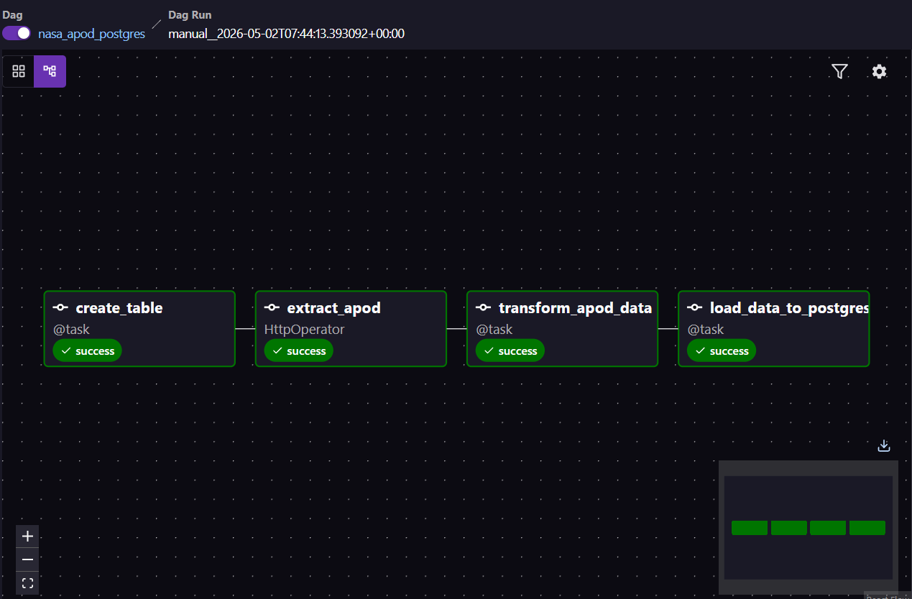
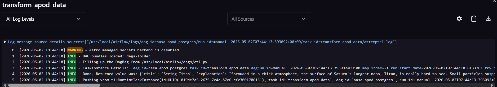
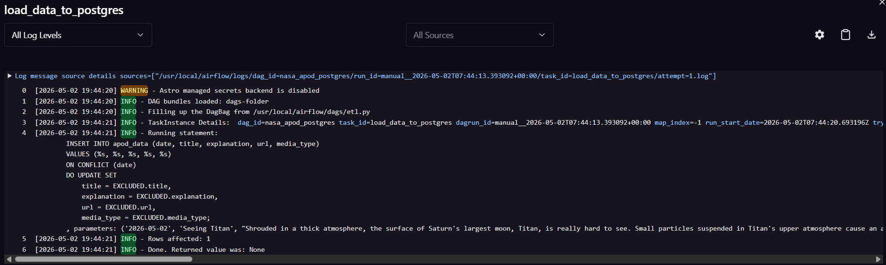
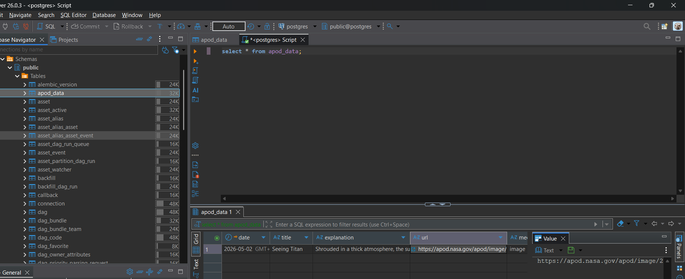

# NASA APOD ETL Pipeline using Apache Airflow
## Project Overview
This project implements an automated ETL (Extract, Transform, Load) pipeline using Apache Airflow to ingest data from NASA’s Astronomy Picture of the Day (APOD) API and store it in a PostgreSQL database. The entire workflow is orchestrated by Airflow, a platform that allows scheduling, monitoring, and managing workflows.

## Tech Stack
* Apache Airflow (Astro CLI)
* Python
* PostgreSQL
* Docker

## Architecture

## Pipeline Workflow
### Extract
* Data is fetched from NASA APOD API using HttpOperator
* API key is securely managed using Airflow connection (password field)

### Transform
* Filters only valid image-type records
* Extracts relevant fields:
    * title
    * explanation
    * url
    * date
    * media_type
 
### Load
* Data is inserted into PostgreSQL using PostgresHook
* Implements upsert logic to prevent duplicates:
  ON CONFLICT (date)
  DO UPDATE SET
      title = EXCLUDED.title,
      explanation = EXCLUDED.explanation,
      url = EXCLUDED.url,
      media_type = EXCLUDED.media_type;
* Ensures no duplicate records and maintains data consistency.

## Database Schema
| column | Type |
|--------|------|
| Date | DATE (Primary Key) |
| title | VARCHAR |
| explanation | TEXT |
| url | TEXT |
| media_type | VARCHAR |

## Key Engineering Decisions
* Used date as primary key to ensure uniqueness
* Implemented ON CONFLICT to make pipeline idempotent
* Stored API key in Airflow connection password field (avoiding masking issues)
* Added retry logic to handle API/network failures

## Challenges & Solutions
| Problem                  | Solution                                            |
| ------------------------ | --------------------------------------------------- |
| API key not passed       | Switched from `extra_dejson` to connection password |
| Deprecated operators     | Replaced `SimpleHttpOperator` with `HttpOperator`   |
| Duplicate data issues    | Introduced primary key + upsert                     |
| Airflow version mismatch | Updated imports and syntax                          |

## Output Example
SELECT * FROM apod_data;

| date        | title          | explanation | url | media_type |
------------|---------------|-----|------ | ------|
| 2026-05-02  | Seeing Titan  | Shrouded in a thick atmosphere, the surface of Saturn's largest moon, Titan, is really hard to see. Small particles suspended in Titan's upper atmosphere cause an almost impenetrable haze, strongly scattering light at visible wavelengths and hiding surface features from prying eyes. Still, Titan's surface is better imaged at infrared wavelengths, where scattering is weaker and atmospheric absorption is reduced. Arrayed around this visible light image (center) of Titan are some of the clearest global infrared views of the tantalizing moon so far. In false color, the six panels present a consistent processing of 13 years of infrared image data from the Visual and Infrared Mapping Spectrometer (VIMS) on board the Cassini spacecraft orbiting Saturn from 2004 to 2017. They offer a stunning comparison with Cassini's visible light view. NASA's revolutionary rotorcraft mission to Titan's surface is due to launch no earlier than July, 2028.| https://apod.nasa.gov/apod/image/2605/PIA21923_fig1SeeingTitan1024.jpg | image |

## Screenshots
### Airflow DAG Execution

### Data Transformation

### Data Load to PostgreSQL

### PostgreSQL Output

 

## What I Learned

- Handling Airflow version incompatibilities
- Debugging API authentication issues
- Designing idempotent pipelines using ON CONFLICT
- Managing Docker-based Airflow environment

